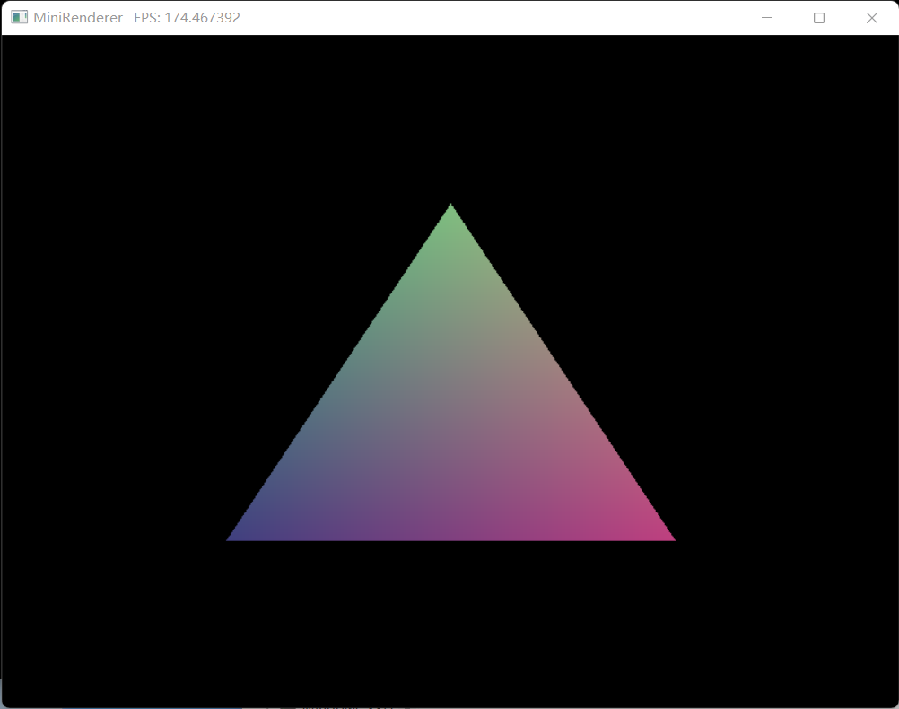
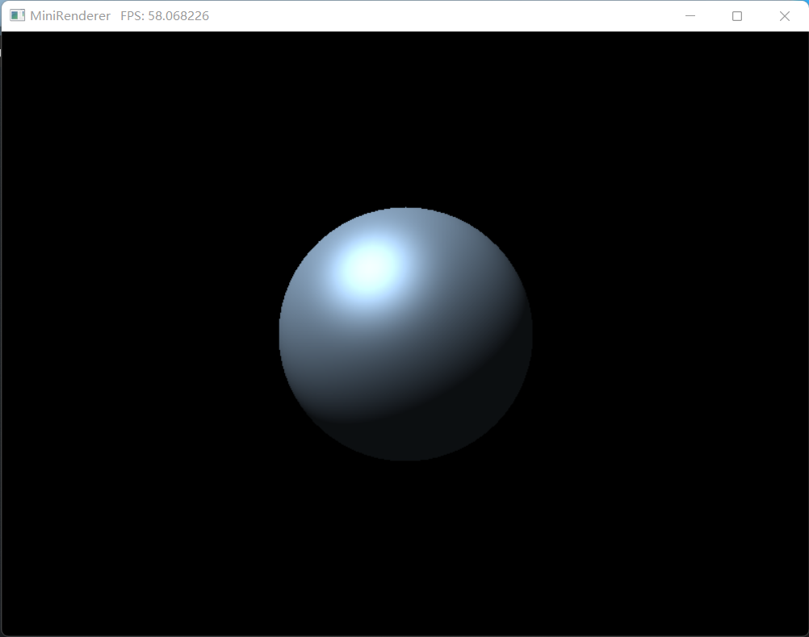

# MiniRenderer
A mini software rasterized renderer

------

#### 特点

------

1. **无第三方库**依赖
2. 只支持 **Windows** 平台
3. **可编程**的渲染管线，可直接在主函数内用 C++ 编写 Shader 代码
4. 目前仍是**单线程**的渲染器
5. 世界坐标空间，视角坐标空间均为 **右手系**


#### 如何编译

------

注意！！！编译需要以下条件

- Windows 系统
- 编译器支持 C++20 （非必须）
- CMake 版本 >= 3.15 (否则需要修改 CMakeLists) 

根目录已有 VS2022ConfigBuild.bat 等脚本，双击可自动构建生成 VS 项目 或 Makefile 构建。

或者可以自己用 命令行构建编译

```shell
cmake --B build
cmake --build build
```


#### 功能

*打勾✔ 代表**已实现**的功能，未打勾❌ 代表**未实现**但将来可能实现的功能*

------

##### 1. 渲染管线

- [x] 顶点着色器
- [ ] 曲面细分着色器
- [ ] 几何着色器
- [x] 简单裁剪（直接裁掉 NDC 空间外顶点）
- [ ] 更好的裁剪
- [x] 屏幕坐标空间映射
- [x] 光栅化
- [ ] MSAA 抗锯齿
- [x] Early-Z
- [x] 片段着色器（像素着色器）
- [ ] 模板测试
- [x] 深度测试
- [ ] 透明度测试

##### 2. 数学库

- [x] 一些基础的向量矩阵运算
- [x] 四元数，复数的支持
- [x] 常用的变换矩阵构造函数 (MVP)
- [x] 支持存储在**栈**上的类型，和存储在**堆**上的动态空间分配类型
- [x] 支持 LU 分解，QR 分解等常见矩阵算法
- [ ] SIMD 对四维向量矩阵的加速

##### 3. 相机组件

- [x] 透视相机
- [x] 类似 Blender 的环绕相机
- [x] 鼠标左键点击拖动将围绕焦点旋转视角，鼠标中键或右键点击拖动可移动相机位置

##### 4. 其他组件

- [x] 时间，计时
- [x] 简单的 FPS 分析
- [ ] 一些基础几何体顶点数据 (目前只有球)


#### 示例

------

##### 例子 1：三角形

如下所示，在 main 函数中定义 Shader 及其 相关 结构体。
随后声明 Renderer 变量，设置其状态。这里需要自定义 lambda 函数赋值给 Renderer 中的 Update 函数变量，
其中因该调用 DrawCall 函数发出绘图指令。
最后要运行 renderer.Run() 函数 然程序运行。

```c++
int main()
{
	// Shader
	struct a2v // 传入顶点着色器的结构
	{
		Vec3 vertex;
		Vec3 color;
	};

	struct v2f : VertexOut // 传出顶点着色器的结构，一定要继承自 VertexOut,  
	{                      // 处理后的顶点数据应赋给 VertexOut 中的 pos, 
		Vec3 color;        // 以便光栅化器能够获取变换后的 顶点
	};

	struct uniform // 定义 uniform 变量，在 main 函数中声明实例，
	{              // 存储例如变换矩阵等变量

	} unif;
	
    // 顶点着色器，lambda 声明，注意要能够引用捕获变量，以获得 uniform 的数据
	VertexShader<a2v, v2f> vert = [&](const a2v& v) -> v2f {
		v2f o;
		o.pos = Vec4(v.vertex, 1.0f);
		o.color = v.color;
		return o;
	};
	
    // 片段着色器
	FragmentShader<v2f> frag = [&](const v2f& i) -> Vec4 {
		auto color = Vec4(i.color * 0.5f + 0.5f, 1.0f);
		return color;
	};
	
    // 声明 Shader，模板类，要提供数据结构类型
	Shader<a2v, v2f, uniform, VertexShader<a2v, v2f>, FragmentShader<v2f>> shader;

	a2v vertices[3] = { // 顶点数据
		{{-0.5f, -0.5f, 0.0f}, {-0.5f, -0.5f, 0.0f}},
		{{ 0.0f,  0.5f, 0.0f}, { 0.0f,  0.5f, 0.0f}},
		{{ 0.5f, -0.5f, 0.0f}, { 0.5f, -0.5f, 0.0f}}
	};
	
    // 要把变量赋给 Shader，
	shader.AddPass(vert, frag, &unif);

	// Renderer
	Renderer renderer(800, 600); // 渲染窗口的大小

	renderer.Update = [&]() { // Update: 更新数据，调用绘图指令
		                 //着色器 // 顶点结构 // 顶点数
        renderer.DrawCall(shader, vertices, 3);
	};

	renderer.Run(); // 运行程序

	return 0;
}
```

###### 效果




##### 例子 2：旋转平面

```c++
int main()
{
	// Shader
	struct a2v
	{
		Vec3 vertex;
		Vec3 color;
	};

	struct v2f : VertexOut
	{
		Vec3 color;
	};

	struct uniform
	{
		Mat4 model;
		Mat4 view;
		Mat4 proj;
	} unif;

	VertexShader<a2v, v2f> vert = [&](const a2v& v) -> v2f {
		v2f o;
		o.pos = unif.proj * unif.view * unif.model * Vec4(v.vertex, 1.0f);
		o.color = v.color;
		return o;
	};

	FragmentShader<v2f> frag = [&](const v2f& i) -> Vec4 {
		auto color = Vec4(i.color, 1.0f);
		return color;
	};

	Shader<a2v, v2f, uniform, VertexShader<a2v, v2f>, FragmentShader<v2f>> shader;

	shader.AddPass(vert, frag, &unif);

	// Vertex Data
	a2v vertices[6] = {
		{{-0.5f, -0.5f, 0.0f}, {1.0f, 0.0f, 0.0f}},
		{{-0.5f,  0.5f, 0.0f}, {0.0f, 1.0f, 0.0f}},
		{{ 0.5f, -0.5f, 0.0f}, {0.0f, 0.0f, 1.0f}},

		{{-0.5f,  0.5f, 0.0f}, {0.0f, 1.0f, 0.0f}},
		{{ 0.5f,  0.5f, 0.0f}, {0.0f, 1.0f, 1.0f}},
		{{ 0.5f, -0.5f, 0.0f}, {0.0f, 0.0f, 1.0f}}
	};

	// Renderer

	Renderer renderer(800, 600);
	auto& camera = renderer.AddCamera(); // 添加相机组件
	camera.Position = { 1.0f, 1.0f, 1.0f };
	camera.CameraLookAt({ 0.0f, 0.0f, 0.0f }, { 0.0f, 0.0f, 1.0f }); // 让相机看向一点
	camera.Fov = 60.0f;

	renderer.Update = [&]() {
		Mat4 mat(1.0f);
		Mat4 trans = Math::Translate(mat, { 0.0f, 0.0f, 0.0f });
		Mat4 rota = Math::Rotate(mat, (float)Time::GetTime(), { 0.0f, 0.0f, 1.0f });
		unif.model = trans * rota;
		unif.view = camera.GetViewMat();
		unif.proj = camera.GetProjectMat();

		renderer.DrawCall(shader, vertices, 6);
	};

	renderer.Run();
	
	return 0;
}
```

###### 效果


##### 例子 3：Blin-Phong 光照模型 渲染的 球

```c++
int main()
{
	// Shader
	struct a2v
	{
		Vec3 vertex;
		Vec2 texcoord;
		Vec3 normal;
	};

	struct v2f : VertexOut
	{
		Vec3 worldPos;
		Vec3 normal;
		Vec3 lightDir;
		Vec3 viewDir;
	};

	struct uniform
	{
		Mat4 model;
		Mat4 view;
		Mat4 proj;
		Vec4 color;
		Light* light = nullptr;
		Camera* camera = nullptr;
	} unif;

	VertexShader<a2v, v2f> vert = [&](const a2v& v) -> v2f {
		v2f o;
		o.worldPos = unif.model * Vec4(v.vertex, 1.0f);
		o.pos = unif.proj * unif.view * Vec4(o.worldPos, 1.0f);
		o.normal = unif.model * Vec4(v.normal, 1.0f);
		o.lightDir = unif.light->GetObjToLightDir(o.worldPos);
		o.viewDir = unif.camera->GetObjToViewDir(o.worldPos);
		return o;
	};

	FragmentShader<v2f> frag = [&](const v2f& i) -> Vec4 {
		Vec3 ambient = unif.color * Vec4(0.1f);

		Vec3 diffuse = unif.color * unif.light->LightColor * Math::Max(Math::Dot(i.normal, i.lightDir), 0.0f);

		Vec3 halfDir = Math::Normailzed(i.lightDir + i.viewDir);
		Vec3 specular = unif.color * unif.light->LightColor * Math::Pow(Math::Max(Math::Dot(i.normal, halfDir), 0.0f), 16.0f);

		Vec3 color = ambient + diffuse + specular;

		return Vec4(color, 1.0f);
	};

	Shader<a2v, v2f, uniform, VertexShader<a2v, v2f>, FragmentShader<v2f>> shader;

	shader.AddPass(vert, frag, &unif);

	// Vertex Data
	a2v* vertices;
	VertexIndex* indices;

	Sphere sphere; // 存有球顶点数据的类
	int indexCount = sphere.GetIndexCount();
	int vertexCount = sphere.GetVertexCount();
	vertices = new a2v[vertexCount];
	indices = new VertexIndex[indexCount];

	for (int i = 0; i < indexCount; ++i)
	{
		indices[i] = sphere.GetIndex(i);
	}
	for (int i = 0; i < vertexCount; ++i)
	{
		vertices[i].vertex = sphere.GetVertex(i);
		vertices[i].texcoord = sphere.GetUV(i);
		vertices[i].normal = sphere.GetNormal(i);
	}

	// Renderer
	Renderer renderer(800, 600);
	renderer.GetRasterizer().RenderDataType = sphere.GetDataType();
	auto& camera = renderer.AddCamera();
	camera.Position = { 3.0f, 3.0f, 0.0f };
	camera.CameraLookAt({ 0.0f, 0.0f, 0.0f }, { 0.0f, 0.0f, 1.0f });
	camera.Fov = 60.0f;

	Light light(Vec3(0.0f, 0.0f, 0.0f));
	light.Rotation = Math::MatToQuat(Math::Rotate(Mat4(1.0f), Math::Radians(30.0f), Vec3(-1.0f, 1.0f, 0.0f))); // 改变平行光指向

	unif.color = Vec4(0.5f, 0.6f, 0.7f, 1.0f);
	unif.light = &light;
	unif.camera = &camera;

	renderer.Update = [&]() {
		Mat4 mat(1.0f);
		unif.model = mat;
		unif.view = camera.GetViewMat();
		unif.proj = camera.GetProjectMat();

		renderer.DrawCall(shader, vertices, vertexCount, indices, indexCount);
	};

	renderer.Run();

	return 0;
}
```

###### 效果


